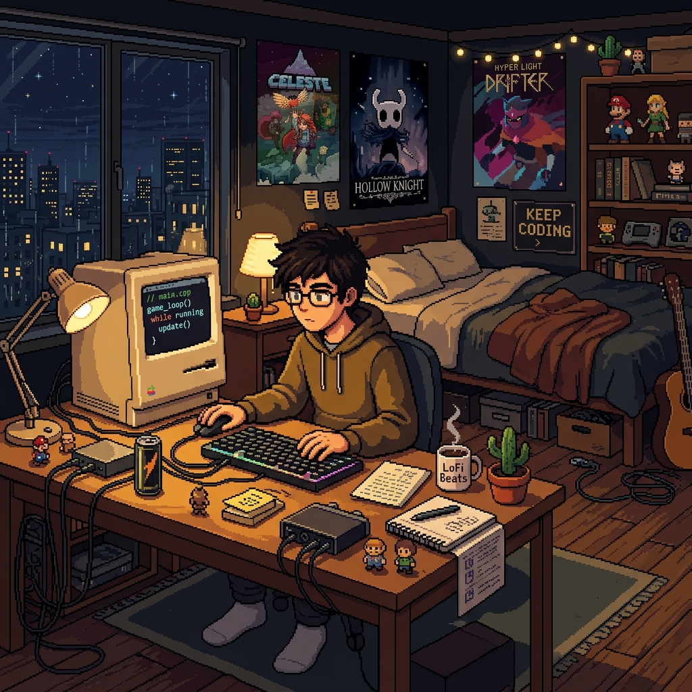

  
  
    
  
  # Hi, I'm Emre 👋
  
  *Learning, building, and staying curious.*

---

### About Me
I'm at the very beginning of my journey into iOS development and programming. I enjoy exploring how things work under the hood, building small projects to test what I've learned, and constantly improving my skills step by step.

I'm currently focused on:
- 📱 Learning **Swift** & **SwiftUI** to build iOS apps.
- 🐍 Understanding the basics of **Python** and logic.
- 📚 Expanding my knowledge in history, philosophy, and technology.

### What I'm Building
Right now, I am taking courses and experimenting with my first iOS projects (like an idea for a screenshot utility app). Every repository you see here is a part of my learning process.

  <i>"The journey of a thousand miles begins with a single step."</i>

